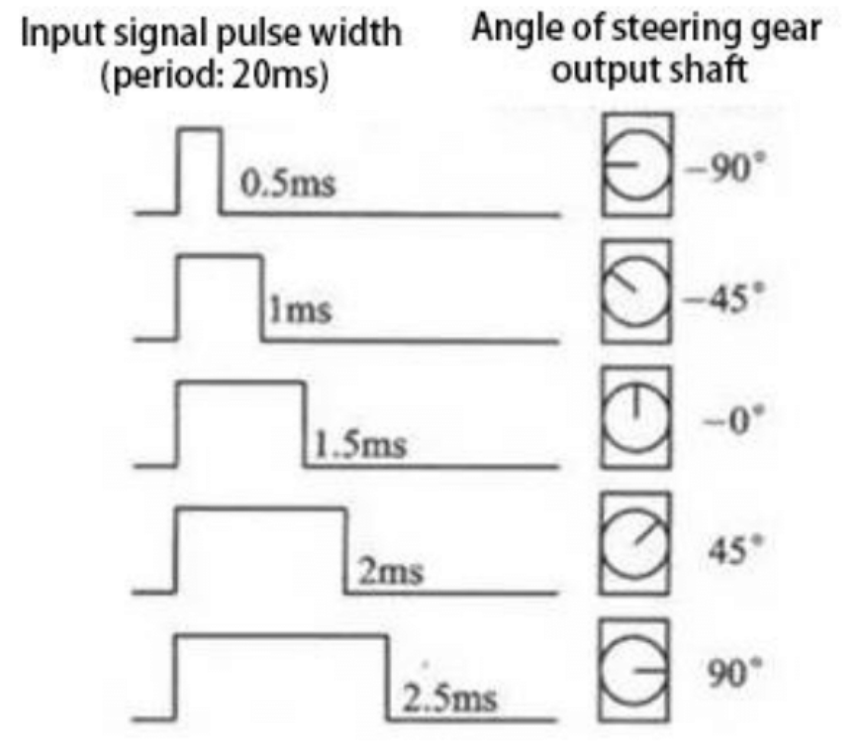

# KS5009_Keyestudio_Smart_Home

## Table of Contents

1. [Project 1: Control led](#project-1-control-led)
    - [Working principle](#working-principle)
    - [Parameters](#parameters)
    - [Control pin](#control-pin)
    - [Project 1.1 LED Flashing](pj1_1_led/README.md)
    - [Project 1.2 Breathing LED](pj1_2_breath_led/README.md)
2. [Project 2: Table Lamp](#project-2-table-lamp)
    - [Description](#description)
    - [Button Principle](#button-principle)
    - [Pins of the Button](#pins-of-the-button)
    - [Project 2.1 Read the Button](pj2_1_button/README.md)
    - [Project 2.2 Table Lamp](pj2_2_button_led/README.md)
3. [Project 3: PIR Motion sensor](#project-3-pir-motion-sensor)
    - [Description](#description-1)
    - [Control Pin](#control-pin-1)
    - [Project 3.1 Read the PIR Motion Sensor](pj3_1_pyroelectric/README.md)
    - [Project 3.2 PIR Motion Sensor](pj3_2_pyroelectric_led/README.md)
4.  [Project 4: Play Music](#project-4-play-music)
    - [Description](#description-2)
    - [Component knowledge](#component-knowledge)
    - [Control Pin](#control-pin-2)
    - [Project 4.1 Play Happy Birthday](pj4_1_buzzer/README.md)
    - [Project 4.2 Music Box](pj4_2_music/README.md)
5. [Project 5: Automatic Doors and Windows](#project-5-automatic-doors-and-wiindows)
    - [Description](#description-3)
    - [Component knowledge](#component-knowledge-1)
    - [Control Pin](#control-pin-3)
    - [Project 5.1 Control the Door](pj5_1_servo/README.md)
    - [Project 5.2 Close the Window](pj5_2_Auto_window/README.md)
6. [Project 6: Atmosphere Lamp](#project-6-atmosphere-lamp)
    - [Description](#description-4)
    - [Component Knowledge](#component-knowledge-2)
    - [Control Pin](#control-pin)
    - [Project 6.1 Control SK6812](pj6_1_sk6812/README.md)
    - [Project 6.2 Button](pj6_2_btn_6812/README.md)

# Project 1: Control led

We will first learn how to control the LED.

## Working Principle

LED is also the light-emitting diode, whiich can be made into an electronic module. It will shine if we control pins to output high level, otherwise it will be off.

## Parameters

| Parameter | Value |
| - | - |
| Working voltage | DC 3~5V |
| Working current | <20A |
| Power | 0.1W |

## Control Pin

| Pin | ID |
| - | - |
| Yellow LED | 12 |

## [Project 1.1 LED Flashing](pj1_1_led/README.md)

## [Project 1.2 Breathing LED](pj1_2_breath_led/README.md)

# Project 2: Table Lamp

## Description

The common table lamp uses LED lights and buttons, which can control the light on and off pressing the button.

## Button Principle

The button module is a digital sensor, which can oonly read 0 os 1. When the module is not pressed, it is in a high level state, that is 1, when pressed, it is a low level 0.

## Pins of the Button

| Pin | ID |
| - | - |
| Button 1 | 16 |
| Button 2 | 27 |

## [Project 2.1 Read the Button](pj2_1_button/README.md)

## [Project 2.2 Table Lamp](pj2_2_button_led/README.md)

# Project 3: PIR Motion sensor

## Description

The PIR motion sensor has many application scenarios in daily life, sucho automatic inductioon lamp of stairs, automatic induction faucet of washbasing, etc.
It is also a digiral sensor like buttons, which has two state values 0 or 1. And it will be sended when people are moving.

It is also a digital sensor like buttons, which has two state values 0 or 1. And it will be sensed when people are moving.

## Control Pin

| Pin | ID |
| - | - |
| PIR motion sensor | 14 |

## [Project 3.1 Read the PIR Motion Sensor](pj3_1_pyroelectric/README.md)

## [Project 3.2 PIR Motion Sensor](pj3_2_pyroelectric_led/README.md)

# Project 4: Play Music

## Description

There is a audio power amplifier element in the car expansion board, wich is an external amplificatio equiipment to play music.

In thiis project, we will work to play a piece of music by using it.

## Component Knowledge

**Pasive Buzzer:** The audio poower amplifier (like the passive buzzer) does not have internal oscillation. When controling we need to input squere waves of different frequencies to the poositive pole of the component and ground the negative pole to control the power amplifier to chiime sounds of different frequencies.

## Control Pin

| Pin | ID |
| - | - |
| Passive Buzzer | 25 |

## [Project 4.1 Play Happy Birthday](pj4_1_buzzer/README.md)

## [Project 4.2 Music Box](pj4_2_music/README.md)

# Project 5: Automatic Doors and Wiindows

## Description

Automatiic doors and windows need powe device, which will become more automatic with a 180 degree servo and some sensors. Addinga a raindrop sensor, you can achieve the efect of closing windows automatically when raining. If adding a RFID, we can realize the effect of swiping to oopen the door and so on.

## Component knowledge

**Servo:** Serco is a position servo driver device consist of a housing, a circuit board, a coreless motor, a gear and a positioon detector.

Its working principle is that the servo receives the signal sent by MCU or receiver an produces a reference signal with a perios of 20ms and wiidth of 1.5ms, then compares the acquired DC bias voltage to the voltage of the potentiometer and obtain the voltage difference output.

The IC on the circuit board judges the direction of rotation, and then drives the coreles motor to start rotation. The power is transmited to the swing arm through the reduction gear, and the signal is sent back by the position detector to judge wheher the positioning has been reached, which is suitable for those control systems that require constant angle change and can be maintained.

When the motor speed is constant, the potentiometer is driven to rotate through the cascade reduction gear, which leads that the voltage difference is 0, and the motor stops rotating. Generally, the angle range of servo rotation is 0º--180º.

The pulse period of the control servo is 20ms, the pulse width is 0.5ms ~ 2.5ms, and the corresponding positionn is -90º ~ +90º. Here is an example of a 180º servo:

In general, servo has three lines in brown, red and orange. The brown wire is grounded, the red one is a positive pole line and the orange one is a signal line.

## Control Pin

All pin numbers are allowed, but only pins 2,4,12-19,21-23,25-27,32-33 are recommended.

| Pin | ID |
| - | - |
| The servo of the window | 33 |
| The servo of the door | 13 |

## [Project 5.1 Control the door](pj5_1_servo/README.md)

## [Project 5.2 Close the Window](pj5_2_Auto_window/README.md)

# Project 6: Atmosphere Lamp

## Description

The atmosphere lamp of smart home is 4 SK6812RGB LEDs. RGB LED belongs too a simple luminous module, wich can adjust the color to bring out the lamp effect of different colors.

Furthermore, it can be widely used in buildings, bridges, roads, gardens, courtyards, floors and other fields of decorative lighting and venue layout, Christmas, Halloween, Valentine's Day, Easter, Natioonal Day as well as other festivals during the atmosphere and other scenes.

In this experiment, we will make various lighting effects.

## Component Knowledge

From the schematic diagram, we can see that these four RGB LEDs are all connected in series. In fact, no matter how many they are, we ca use a pin to control a RGB LED and let it display any color. Each RGBLED iis an independent pixel, composed of R, G and B colors, wich can achieve 256 levels of brightness display and complete the full true color display of 16777216 colors.

What's more, the pixel point contains a data latch signal shaping amplifier drive circuit and a signal shaping circuit, which effectively ensures the color of the pixel point light is highly consistent.

## Control Pin

| Pin | ID |
| - | - |
| SK6812 | 26 |

## [Project 6.1 Control SK6812](pj6_1_sk6812/README.md)

## [Project 6.2 Button](pj6_2_btn_6812/README.md)