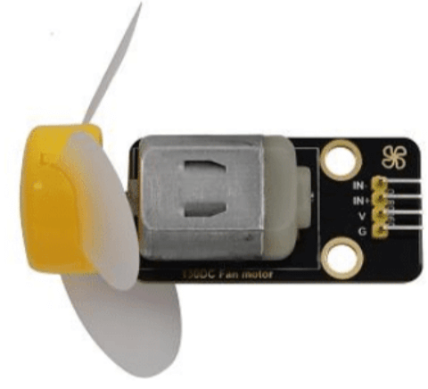
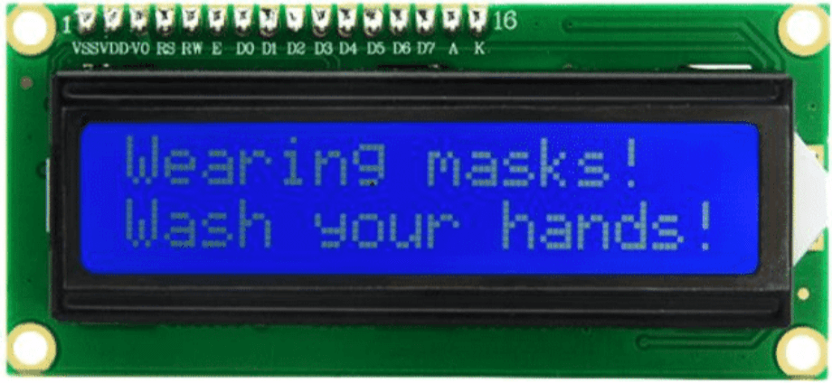

# KS5009 Keyestudio Smart Home

## Description
*(from [KS5009 Keyestudio Smart Home Wiki Page](https://wiki.keyestudio.com/KS5009_Keyestudio_Smart_Home))*

As the rapid development of the Internet grows, various intelligent devices are gradually integrated into our daily life.

For example, we can use RFID to open the door. In addition, the kitchen is equipped with a gas detection alarm, which alerts people to the danger when dangerous gas and large smoke are detected. When it detects rain, it can automatically collect clothes and close windows. All kinds of electrical equipment can be controlled by mobile phone, control lights, fans, air conditioning and so on.

In this connection, we seek to launch this smart home product with ESP32 control, which has a host of sensors and modules as well as networking function, making the relevant knowledge of the Internet more accessible to you.

## Tutorials

You can find one project for each component to learn how it works and make things happen.

### Project 1: Control led

We will first learn how to control the LED.

<figure>
    
    <figcaption>LED module.</figcaption>
</figure>

#### Working Principle

LED is also the light-emitting diode, whiich can be made into an electronic module. It will shine if we control pins to output high level, otherwise it will be off.

#### Parameters

| Parameter | Value |
| - | - |
| Working voltage | DC 3~5V |
| Working current | <20A |
| Power | 0.1W |

#### Control Pin

| Pin | ID |
| - | - |
| Yellow LED | 12 |

#### [Project 1.1 LED Flashing](pj1_1_led/README.md)

#### [Project 1.2 Breathing LED](pj1_2_breath_led/README.md)

### Project 2: Table Lamp

#### Description

The common table lamp uses LED lights and buttons, which can control the light on and off pressing the button.

#### Button Principle

The button module is a digital sensor, which can oonly read 0 os 1. When the module is not pressed, it is in a high level state, that is 1, when pressed, it is a low level 0.

<figure>
    
    <figcaption>Button module.</figcaption>
</figure>

#### Pins of the Button

| Pin | ID |
| - | - |
| Button 1 | 16 |
| Button 2 | 27 |

#### [Project 2.1 Read the Button](pj2_1_button/README.md)

#### [Project 2.2 Table Lamp](pj2_2_button_led/README.md)

### Project 3: PIR Motion sensor

#### Description

The PIR motion sensor has many application scenarios in daily life, sucho automatic inductioon lamp of stairs, automatic induction faucet of washbasing, etc.
It is also a digiral sensor like buttons, which has two state values 0 or 1. And it will be sended when people are moving.

It is also a digital sensor like buttons, which has two state values 0 or 1. And it will be sensed when people are moving.

<figure>
    
    <figcaption>PIR Motion Sensor.</figcaption>
</figure>

#### Control Pin

| Pin | ID |
| - | - |
| PIR motion sensor | 14 |

#### [Project 3.1 Read the PIR Motion Sensor](pj3_1_pyroelectric/README.md)

#### [Project 3.2 PIR Motion Sensor](pj3_2_pyroelectric_led/README.md)

### Project 4: Play Music

#### Description

There is a audio power amplifier element in the car expansion board, wich is an external amplificatio equiipment to play music.

In thiis project, we will work to play a piece of music by using it.

#### Component Knowledge

**Pasive Buzzer:** The audio poower amplifier (like the passive buzzer) does not have internal oscillation. When controling we need to input squere waves of different frequencies to the poositive pole of the component and ground the negative pole to control the power amplifier to chiime sounds of different frequencies.

<figure>
    
    <figcaption>Passive Buzzer Module.</figcaption>
</figure>

#### Control Pin

| Pin | ID |
| - | - |
| Passive Buzzer | 25 |

#### [Project 4.1 Play Happy Birthday](pj4_1_buzzer/README.md)

#### [Project 4.2 Music Box](pj4_2_music/README.md)

### Project 5: Automatic Doors and Wiindows

#### Description

Automatiic doors and windows need powe device, which will become more automatic with a 180 degree servo and some sensors. Addinga a raindrop sensor, you can achieve the efect of closing windows automatically when raining. If adding a RFID, we can realize the effect of swiping to oopen the door and so on.

#### Component knowledge

**Servo:** Serco is a position servo driver device consist of a housing, a circuit board, a coreless motor, a gear and a positioon detector.

Its working principle is that the servo receives the signal sent by MCU or receiver an produces a reference signal with a perios of 20ms and wiidth of 1.5ms, then compares the acquired DC bias voltage to the voltage of the potentiometer and obtain the voltage difference output.

The IC on the circuit board judges the direction of rotation, and then drives the coreles motor to start rotation. The power is transmited to the swing arm through the reduction gear, and the signal is sent back by the position detector to judge wheher the positioning has been reached, which is suitable for those control systems that require constant angle change and can be maintained.

When the motor speed is constant, the potentiometer is driven to rotate through the cascade reduction gear, which leads that the voltage difference is 0, and the motor stops rotating. Generally, the angle range of servo rotation is 0º--180º.

The pulse period of the control servo is 20ms, the pulse width is 0.5ms ~ 2.5ms, and the corresponding positionn is -90º ~ +90º. Here is an example of a 180º servo:

<figure>
    
    <figcaption>Servo.</figcaption>
</figure>

In general, servo has three lines in brown, red and orange. The brown wire is grounded, the red one is a positive pole line and the orange one is a signal line.

<figure>
    
    <figcaption>Servo wiring.</figcaption>
</figure>

<figure>
    
    <figcaption>Microservo.</figcaption>
</figure>

#### Control Pin

All pin numbers are allowed, but only pins 2,4,12-19,21-23,25-27,32-33 are recommended.

| Pin | ID |
| - | - |
| The servo of the window | 33 |
| The servo of the door | 13 |

#### [Project 5.1 Control the door](pj5_1_servo/README.md)

#### [Project 5.2 Close the Window](pj5_2_Auto_window/README.md)

### Project 6: Atmosphere Lamp

#### Description

The atmosphere lamp of smart home is 4 SK6812RGB LEDs. RGB LED belongs too a simple luminous module, wich can adjust the color to bring out the lamp effect of different colors.

Furthermore, it can be widely used in buildings, bridges, roads, gardens, courtyards, floors and other fields of decorative lighting and venue layout, Christmas, Halloween, Valentine's Day, Easter, Natioonal Day as well as other festivals during the atmosphere and other scenes.

In this experiment, we will make various lighting effects.

#### Component Knowledge

From the schematic diagram, we can see that these four RGB LEDs are all connected in series. In fact, no matter how many they are, we ca use a pin to control a RGB LED and let it display any color. Each RGBLED iis an independent pixel, composed of R, G and B colors, wich can achieve 256 levels of brightness display and complete the full true color display of 16777216 colors.

What's more, the pixel point contains a data latch signal shaping amplifier drive circuit and a signal shaping circuit, which effectively ensures the color of the pixel point light is highly consistent.

<figure>
    
    <figcaption>RGB LED Schema.</figcaption>
</figure>

<figure>
    
    <figcaption>RGB LED.</figcaption>
</figure>

#### Control Pin

| Pin | ID |
| - | - |
| SK6812 | 26 |

#### [Project 6.1 Control SK6812](pj6_1_sk6812/README.md)

#### [Project 6.2 Button](pj6_2_btn_6812/README.md)

### Project 7: Fan

#### Description

In this project, we wiill learn how to make a small fan.

#### Component knowledge

The small fan uses a 130 DC motor and safe fan blades. You can use PWM output the fan speed.

<figure>
    
    <figcaption>Fan.</figcaption>
</figure>

#### Control Method

Two pins are required to control the motor of the fan, one for INA and two for INB. The PWM value range is 0~255. When the PWM output of the two pins is different, the fan can rotate.

| Value | Action |
| - | - |
| INA - INB <= -45 | Rotate clockwise |
| INA - INB >= 45 | Rotate anticlockwise |
| INA == 0, INB == 0 | Stop |

#### Control Pins

| Pin | ID |
| - | - |
| INA | 19 |
| INB | 18 |

#### [Project 7.1 Control the Fan](pj7_1_fan/README.md)

#### [Project 7.2 Switch On or Off the Fan](pj7_2_btn_fan/README.md)

### Project 8: LCD1602 Display

#### Description

As we all know, screen is one of the best ways for people to interact with electronics devices.

#### Component Knowledge

1602 is a line tha can display 16 characters. There are wo lines, wich use IIC communication protocol.

<figure>
    
    <figcaption>LCD1602.</figcaption>
</figure>

#### Control Pins

| Pin | ID |
| - | - |
| SDA | SDA |
| SCL | SCL |

#### [Project 8.1 Display Characters](pj8_1_lcd/README.md)

#### [Project 8.2 Dangerous Gas Alarm](pj8_2_gas_lcd/README.md)

### Project 9: Temperature and Humidity Sensor

#### Component Knowledge

Its communication mode is serial data and single bus. The temperature measurement range is -2 ~ +60, accuracy is +- 2. However, the humidity range is 5 ~ 95% RH, the accuracy is +-5% RH.

<figure>
    
    <figcaption>HumidityTemperature.</figcaption>
</figure>

#### Control Pin

| Pin | ID |
| - | - |
| Temperature and Humidity Sensor | 17 |

#### [Project 9.1 Temperature and Humidity Tester](pj9_1_XHT11/README.md)

### Project 10: RFID RC522 Module

#### Component Knowledge

Radio frequency identification, the card reader is composed of a radio frequency module and a high-level magnetic field. The Tag transponder is a sensing device, which doesn't contain a battery. It only contains tiny integrated circuit chips and media for storing data and antennas for receiving and transmitting signals.

To read the data is the tag, first put it into the reading range of the card reader. The reader will generate a magnetic field, which can produce electricity according to Lenz's law, then the RFID tag will supply power, thereby activating the device.

#### Control Pins

Use IIC communication.

| Pin | ID |
| - | - |
| SDA | SDA |
| SCL | SCL |

#### [Project 10.1 Open the Door](pj10_1_RFID/README.md)

### Project 11: Morse Code

Morse code, also known as Morse password, is an on-again, off-again signal code that expresses different letters, numbers, and punctuation marks in different sequences. Now we use it as our password gate.
The Morse code corresponds to the following characters:

<figure>
    
    <figcaption>Morse code.</figcaption>
</figure>

#### [Project 11.1 Morse Code Open the Door](pj11_1_mosDoor/README.md)

### Project 12: WiFi

The easiest way to access the Internet is to use a WiFi to connect. The ESP32 main control board comes with a WiFi module, making our smart home accessible to the Internet easily.

<figure>
    
    <figcaption>WiFi.</figcaption>
</figure>

#### [Project 12.1 Smart Home](pj12_1_wifi_test/README.md)

#### [Project 12.2 Control Smart Home](pj12_2_wifi_led/README.md)

### Project 13: Mobile Phone APP

#### Download APP

##### Download from Google play

Please search for keyes IoT home on Google play to download it.  
Icon:  

<figure>
    
    <figcaption>App icon.</figcaption>
</figure>

##### Download iOS APP

Please search for keyes IoT home on APP Store to download it. 

#### APP Interface

<figure>
    
    <figcaption>APP interface.</figcaption>
</figure>

#### [Project 13.1 Test APP](pj13_1_app_test/README.md)

#### [Project 13.2 IoT Smart Home](pj13_2_IoT_smart_home/README.md)
