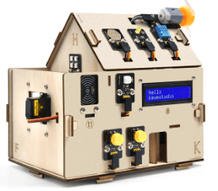

<!-- _coverpage.md -->

# KS5009 Key Studio Smart Home<small>customized</small>

> A Repo with all you need to get started with KS5009 kit from keystudio.

- Based on Keystudio documentation
- Using [vscode](https://code.visualstudio.com/) and [PlatformIO](https://platformio.org/)

[GitHub](https://github.com/teanocrata/KS5009_Keyestudio_Smart_Home)
[Get Started](README.md)