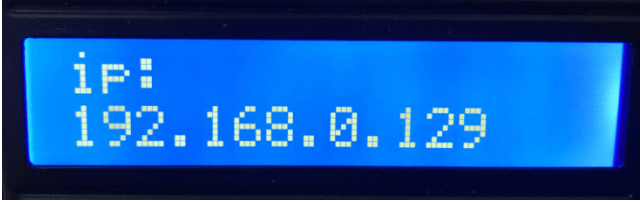

[Back to HOME](../README.md)

# Project 12.2 Control Smart Home

## Description

In this project, we will learn how to realize different functions of the smart home through accessing different strings under the address. There is a LCD screen that can print out the IP address, which is much more convenient.

You need to create a new file at [include/credentials.h](include/credentials.h) with your home ssid and password like:

```cpp
// include/credentials.h
#define WIFI_SSID "your_ssid"
#define WIFI_PASSWORD "your_password"
```

## Test code

[src/pj12_2_wifi_led.cpp](src/pj12_2_wifi_led.cpp)

## Test result

If the smart home is successfully connected to WiFi, the LCD screen will display the assigned address.  



Accessing address must add / led/on when using the browser, such as my address is 192.168.0.129/ led/on. Then the smart home LED lights will be turned on, if accessing 192.168.0.129/ led /off, then the LED lights will be off.


When the browser accesses 192.168.0.129/fan/ on, the fan of the smart home will be turned on and at 192.168.0.129/fan/ off will be turned off.


