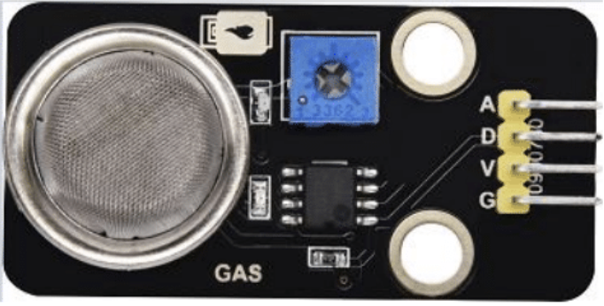

[Back to HOME](../README.md)

# Project 8.2 Dangerous Gas Alarm

## Description

When a gas sensor detects a hih concentration of dangerous gass, the buzzer will sound an alarm and the display will show dangerous.

## Component Knowledge

**MQ2 Smoke Sendor:** It is a gas leak monitoring device for homes and factories, wich is suitable for liquefied gas, benzene, alkyl, alcohol, hydrogen as well as smoke detection. Our sensor leads to digital pin D and analog output pin A, wich is connected to D as a digital sensor in this project.

## Test Code

[src/pj8_2_gas_lcd.cpp](src/pj8_2_gas_lcd.cpp)

## Test result

The screen displays "safety" in normal state. However, when the gas sensor detects some dangerous gases, such as carbon monoxide, at a certain concentration, the buxzzer sound an alarm and the screen displays "dangerous".
